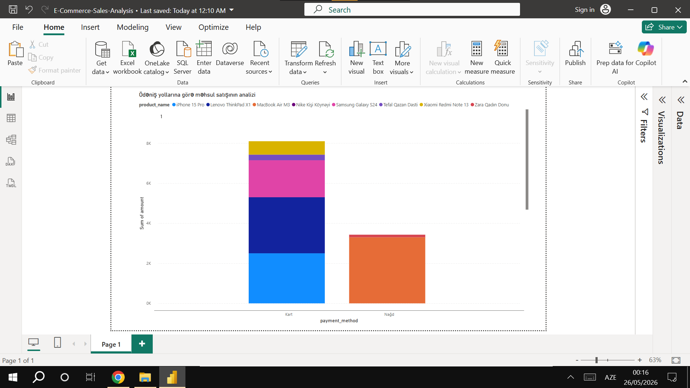

#E-Commerce Sales Analysis & Dashboard

Bu layihə, elektron ticarət (E-Commerce) satış məlumatlarının analiz edilməsi, SQL sorğuları vasitəsilə datanın təmizlənməsi və Power Bi mühitində vizuallaşdırılması məqsədilə hazırlanmışdır.

---

 Layihə Haqqında
Layihə çərçivəsində müvafiq biznes suallarına cavab tapmaq üçün fərqli məhsul kateqoriyalarının satış dinamikası və istifadəçilərin ödəniş vərdişləri analiz olunmuşdur.

 İstifadə Olunan Texnologiyalar:
* **Verilənlər Bazası:** SQL (PostgreSQL / MySQL)
* **Biznes Analitikası (BI):** Power BI Desktop
* **Versiya Kontrolü:** Git & GitHub

---

Satış Dashboard-u

Layihənin əsas vizual nəticəsi (Ödəniş üsullarına görə məhsul satışının analizi):

---
 SQL Analiz Mərhələsi
Data strukturlarını qurmaq və təmizləmək üçün yazılmış SQL kodları repozitoriyadakı `database_setup.sql` (və ya sənin SQL faylının adı) faylında yer alır. 

 Əsas Analiz Olunan Göstəricilər:
* Ödəniş növlərinə (Kart və Nağd) görə satış payı
* Ən çox satılan top məhsullar (MacBook Air M3, iPhone 15 Pro, Lenovo ThinkPad və s.)
* Ümumi məbləğ (Sum of Total Amount) generasiyası
